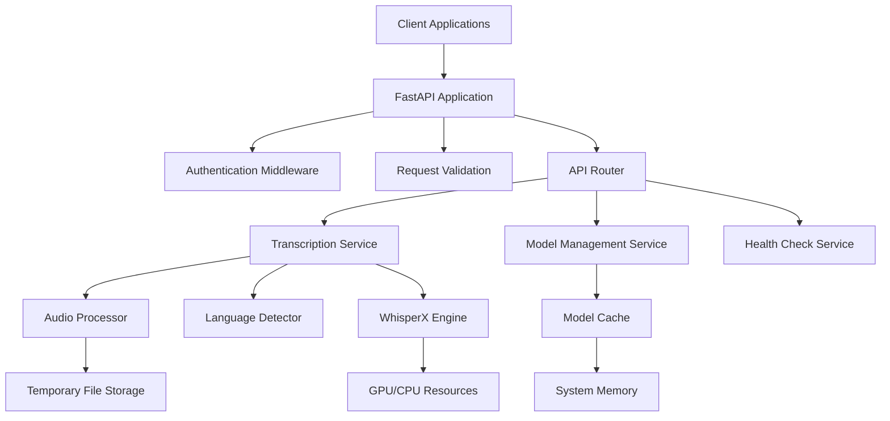

# Design Document

## Overview

The WhisperX FastAPI Server transforms the existing transcribe.py script into a production-ready REST API service that provides OpenAI-compatible audio transcription capabilities. The server maintains the intelligent language detection and audio preprocessing features while exposing them through a robust, scalable web service architecture.

The design follows FastAPI best practices with proper separation of concerns, comprehensive error handling, and efficient resource management. The server supports multiple response formats (JSON, SRT, VTT, text) and provides model management capabilities for optimal performance.

## Architecture

### High-Level Architecture



### Service Layer Architecture

The application follows a layered architecture pattern:

1. **API Layer**: FastAPI routers and endpoints
2. **Service Layer**: Business logic and orchestration
3. **Processing Layer**: Audio processing and ML inference
4. **Storage Layer**: Model caching and temporary file management

## Components and Interfaces

### 1. FastAPI Application Structure

```python
# Main application structure
app/
├── main.py                 # FastAPI app initialization
├── api/
│   ├── __init__.py
│   ├── v1/
│   │   ├── __init__.py
│   │   ├── transcriptions.py  # /v1/audio/transcriptions
│   │   ├── translations.py    # /v1/audio/translations
│   │   └── models.py          # Model management endpoints
│   └── health.py           # Health check endpoints
├── services/
│   ├── __init__.py
│   ├── transcription.py    # Core transcription logic
│   ├── model_manager.py    # Model loading/caching
│   ├── audio_processor.py  # Audio preprocessing
│   └── language_detector.py # Language detection
├── models/
│   ├── __init__.py
│   ├── requests.py         # Pydantic request models
│   ├── responses.py        # Pydantic response models
│   └── config.py          # Configuration models
├── core/
│   ├── __init__.py
│   ├── config.py          # Application configuration
│   ├── exceptions.py      # Custom exceptions
│   └── logging.py         # Logging configuration
└── utils/
    ├── __init__.py
    ├── file_utils.py      # File handling utilities
    ├── format_utils.py    # Response formatting
    └── transcribe_utils.py # Utility functions from transcribe.py
```

### 2. Core Services

#### TranscriptionService
- **Purpose**: Orchestrates the complete transcription workflow
- **Key Methods**:
  - `transcribe_audio()`: Main transcription endpoint logic
  - `detect_language()`: Intelligent language detection
  - `preprocess_audio()`: Audio preprocessing pipeline
  - `format_response()`: Response formatting for different output types

#### ModelManager
- **Purpose**: Manages WhisperX model lifecycle and caching
- **Key Methods**:
  - `load_model()`: Load and cache models
  - `unload_model()`: Remove models from memory
  - `get_model()`: Retrieve cached model instance
  - `list_models()`: Get currently loaded models

#### AudioProcessor
- **Purpose**: Handles audio file processing and preprocessing (from transcribe.py logic)
- **Key Methods**:
  - `trim_leading_silence()`: Uses pydub.silence.detect_nonsilent(audio, 300, -35)
  - `export_chunk()`: Creates temporary WAV files with 10-second duration
  - `extract_language_samples()`: Creates 3 strategic samples for language detection
  - `validate_audio()`: Audio file validation
  - `cleanup_temp_files()`: Temporary file management
- **Sample Extraction Logic** (exact from transcribe.py):
  ```python
  # Three strategic positions for language detection
  starts = {
      lead_ms,  # After silence trimming
      max(lead_ms + (dur_ms - lead_ms) // 3 - 5_000, lead_ms),  # 1/3 position
      max(lead_ms + 2 * (dur_ms - lead_ms) // 3 - 5_000, lead_ms),  # 2/3 position
  }
  ```

#### LanguageDetector
- **Purpose**: Implements intelligent language detection logic (exact from transcribe.py)
- **Key Methods**:
  - `detect_from_samples()`: Process 3 audio chunks with detector model
  - `filter_by_confidence()`: Apply min_prob threshold (default 0.6)
  - `select_best_language()`: Vote counting + confidence sum tie-breaking
  - `fallback_detection()`: Re-run without confidence filter if all filtered out
- **Selection Algorithm** (exact from transcribe.py):
  ```python
  # Language selection with vote count and confidence sum
  best = max(votes, key=lambda lang: (votes[lang], prob_sum[lang]))
  mean_p = prob_sum[best] / votes[best] if votes[best] else 0
  ```

### 3. Request/Response Models

#### Transcription Request Model
```python
class TranscriptionRequest(BaseModel):
    file: UploadFile
    model: Optional[str] = "large-v3"
    language: Optional[str] = None
    prompt: Optional[str] = None
    response_format: Optional[str] = "json"
    temperature: Optional[float] = 0.0
    timestamp_granularities: Optional[List[str]] = ["segment"]
    # Additional WhisperX-specific parameters
    beam_size: Optional[int] = 2
    suppress_tokens: Optional[List[str]] = None
    vad_options: Optional[Dict[str, Any]] = None
```

#### Transcription Response Models
```python
class TranscriptionSegment(BaseModel):
    id: int
    seek: float
    start: float
    end: float
    text: str
    tokens: List[int]
    temperature: float
    avg_logprob: float
    compression_ratio: float
    no_speech_prob: float

class TranscriptionResponse(BaseModel):
    text: str
    segments: List[TranscriptionSegment]
    language: str
    duration: float
    # Additional metadata
    model_used: str
    processing_time: float
```

### 4. API Endpoints

#### Primary Endpoints
- `POST /v1/audio/transcriptions` - OpenAI-compatible transcription
- `POST /v1/audio/translations` - OpenAI-compatible translation
- `GET /healthcheck` - Service health status
- `GET /models/list` - List loaded models
- `POST /models/load` - Load specific model
- `POST /models/unload` - Unload specific model

#### Endpoint Specifications

**POST /v1/audio/transcriptions**
- Accepts multipart/form-data with audio file
- Supports all OpenAI transcription parameters
- Returns JSON, SRT, VTT, or plain text based on response_format
- Implements intelligent language detection when language not specified
- Applies audio preprocessing (silence trimming, token suppression)

## Data Models

### Configuration Model
```python
class AppConfig(BaseModel):
    # Server configuration
    host: str = "0.0.0.0"
    port: int = 8000
    workers: int = 1
    
    # Model configuration (from transcribe.py defaults)
    default_model: str = "large-v3"
    detector_model: str = "small"
    device: str = "cuda" if torch.cuda.is_available() else "cpu"
    
    # Processing configuration (from transcribe.py)
    batch_size: int = 8
    min_prob: float = 0.6  # Language detection confidence threshold
    max_file_size: int = 100 * 1024 * 1024  # 100MB
    
    # Audio processing (exact values from transcribe.py)
    silence_min_duration: int = 300  # detect_nonsilent parameter
    silence_threshold: int = -35     # detect_nonsilent parameter
    chunk_duration: int = 10_000     # 10 seconds for language detection samples
    chunk_offset: int = 5_000        # 5 second offset for sample positioning
    
    # Language detection (from transcribe.py logic)
    detector_batch_size: int = 4     # batch_size for language detection
    detector_compute_type: str = "int8"  # compute_type for detector model
    
    # ASR options (exact from transcribe.py asr_opts)
    asr_options: Dict[str, Any] = {
        "beam_size": 2,
        "condition_on_previous_text": False,
        "temperatures": [0.0],
        "no_speech_threshold": 0.6,
    }
    
    # VAD options (exact from transcribe.py vad_opts)
    vad_options: Dict[str, Any] = {
        "min_silence_duration_ms": 500,
        "speech_pad_ms": 200
    }
    
    # Suppression tokens (exact from transcribe.py STOP)
    suppress_phrases: List[str] = [
        "дима торжок", "dima torzok", "dima torzhok", "субтитры подогнал"
    ]
    
    # Compute type logic (from transcribe.py)
    def get_compute_type(self, device: str) -> str:
        return "float16" if device == "cuda" else "int8"
```

### Model Cache Structure
```python
class ModelCacheEntry(BaseModel):
    model_name: str
    model_instance: Any  # WhisperX model instance
    load_time: datetime
    last_used: datetime
    memory_usage: int
    device: str
```

## Error Handling

### Exception Hierarchy
```python
class WhisperXAPIException(Exception):
    """Base exception for WhisperX API"""
    pass

class AudioProcessingError(WhisperXAPIException):
    """Audio file processing errors"""
    pass

class ModelLoadError(WhisperXAPIException):
    """Model loading/management errors"""
    pass

class TranscriptionError(WhisperXAPIException):
    """Transcription processing errors"""
    pass

class ValidationError(WhisperXAPIException):
    """Request validation errors"""
    pass
```

### Error Response Format (OpenAI Compatible)
```python
class ErrorResponse(BaseModel):
    error: Dict[str, Any] = {
        "message": str,
        "type": str,
        "param": Optional[str],
        "code": Optional[str]
    }
```

### Error Handling Strategy
1. **Input Validation**: Pydantic models with custom validators
2. **File Upload Errors**: Size limits, format validation, corruption detection
3. **Model Errors**: Loading failures, memory issues, device compatibility
4. **Processing Errors**: Transcription failures, timeout handling
5. **Resource Errors**: Memory exhaustion, disk space, GPU availability

## Testing Strategy

### Test Categories

#### 1. Unit Tests
- **Service Layer Tests**: Individual service method testing
- **Utility Function Tests**: Audio processing, formatting utilities
- **Model Tests**: Request/response model validation
- **Configuration Tests**: Config loading and validation

#### 2. Integration Tests
- **API Endpoint Tests**: Full request/response cycle testing
- **Model Management Tests**: Loading, caching, unloading workflows
- **Audio Processing Pipeline Tests**: End-to-end audio processing
- **Error Handling Tests**: Exception propagation and formatting

#### 3. Performance Tests
- **Load Testing**: Concurrent request handling
- **Memory Usage Tests**: Model caching efficiency
- **Processing Time Tests**: Transcription performance benchmarks
- **Resource Utilization Tests**: GPU/CPU usage optimization

#### 4. Compatibility Tests
- **OpenAI API Compatibility**: Request/response format validation
- **Audio Format Support**: Various audio file format testing
- **Model Compatibility**: Different WhisperX model testing
- **Device Compatibility**: CPU/GPU processing validation

### Test Implementation Framework
- **pytest**: Primary testing framework
- **pytest-asyncio**: Async test support
- **httpx**: HTTP client for API testing
- **pytest-mock**: Mocking framework
- **pytest-cov**: Coverage reporting

### Test Data Management
- **Sample Audio Files**: Various formats, languages, qualities
- **Mock Responses**: OpenAI API response examples
- **Test Fixtures**: Reusable test data and configurations
- **Performance Baselines**: Expected processing times and resource usage

### Continuous Integration
- **Automated Testing**: Run on every commit/PR
- **Coverage Requirements**: Minimum 85% code coverage
- **Performance Regression**: Automated performance benchmarking
- **Security Scanning**: Dependency vulnerability checks

### Utility Functions (from transcribe.py)

#### Timestamp Formatting
```python
def ts(sec):
    """Convert seconds to SRT timestamp format (exact from transcribe.py)"""
    td = timedelta(seconds=sec)
    h, m, s = str(td).split(":")
    s, ms = s.split(".")
    return f"{int(h):02}:{int(m):02}:{int(s):02},{int(ms):03}"
```

#### Text Cleaning
```python
def clean(txt):
    """Remove suppressed phrases from transcription text (exact from transcribe.py)"""
    STOP = ["дима торжок", "dima torzok", "dima torzhok", "субтитры подогнал"]
    for p in STOP:
        txt = txt.replace(p, "")
    return " ".join(txt.split())
```

#### Token Suppression Setup
```python
def get_suppress_tokens():
    """Generate suppress tokens from phrases (exact from transcribe.py)"""
    from whisper.tokenizer import get_tokenizer
    STOP = ["дима торжок", "dima torzok", "dima torzhok", "субтитры подогнал"]
    tok = get_tokenizer(multilingual=True)
    return sorted({t for p in STOP for t in tok.encode(p)})
```

#### Audio Chunk Export
```python
def export_chunk(audio: AudioSegment, start_ms: int, dur: int = 10_000) -> str:
    """Export audio chunk to temporary WAV file (exact from transcribe.py)"""
    with tempfile.NamedTemporaryFile(delete=False, suffix=".wav") as tmp:
        audio[start_ms : start_ms + dur].export(tmp.name, format="wav")
        return tmp.name
```

This design provides a robust, scalable, and maintainable architecture that transforms the original transcribe.py script into a production-ready FastAPI service while preserving ALL the intelligent language detection, audio processing capabilities, and exact configurations from your original implementation.